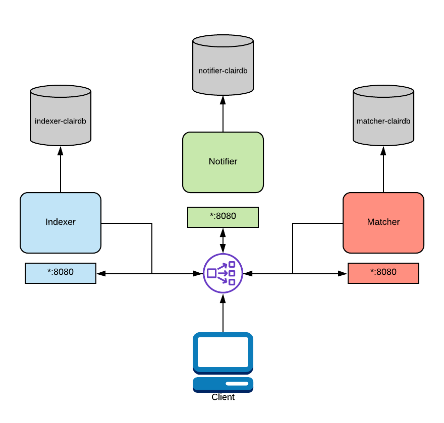

# Deploying Clair

Clair v4 was designed with flexible deployment architectures in mind.
An operator is free to choose a deployment model which scales to their use cases.

## Configuration

Before jumping directly into the models, its important to note that Clair is designed to use a single configuration file across all node types.
This design decision makes it very easy to deploy on systems like Kubernetes and OpenShift.

See [Config Reference](../reference/config.md)

## Combined Deployment

In a combined deployment, all the Clair processes run in a single OS process.
This is by far the easiest deployment model to configure as it involves the least moving parts. 

A load balancer is still recommended if you plan on performing TLS termination.
Typically this will be a OpenShift route or a Kubernetes ingress.


In the above diagram, Clair is running in combo mode and talking to a single database.
To configure this mode, you will provide all node types the same database and start Clair in **combo** mode.

```
...
indexer:
    connstring: "host=clairdb user=pqgotest dbname=pqgotest sslmode=verify-full"
matcher:
    connstring: "host=clairdb user=pqgotest dbname=pqgotest sslmode=verify-full"
    ...
notifier:
    connstring: "host=clairdb user=pqgotest dbname=pqgotest sslmode=verify-full"
    ...
```
In this mode, any configuration informing Clair how to talk to other nodes is ignored;
it is not needed as all intra-process communication is done directly.

For added flexibility, it's also supported to split the databases while in combo mode.


In the above diagram, Clair is running in combo mode but database load is split between multiple databases.
Since Clair is conceptually a set of micro-services, its processes do not share database tables even when combined into the same OS process.

To configure this mode, you would provide each process its own "connstring" in the configuration. 
```
...
indexer:
    connstring: "host=indexer-clairdb user=pqgotest dbname=pqgotest sslmode=verify-full"
matcher:
    connstring: "host=matcher-clairdb user=pqgotest dbname=pqgotest sslmode=verify-full"
    ...
notifier:
    connstring: "host=notifier-clairdb user=pqgotest dbname=pqgotest sslmode=verify-full"
    ...
```

## Distributed Deployment

If your application needs to asymmetrically scale or you expect high load you may want to consider a distributed deployment.

In a distributed deployment, each Clair process runs in its own OS process.
Typically this will be a Kubernetes or OpenShift Pod.

A load balancer **must** be setup in this deployment model.
The load balancer will route traffic between Clair nodes along with routing API requests via [path based routing] to the correct services.
In a Kubernetes or OpenShift deployment this is usually handled with the `Service` and `Route` abstractions.
If deploying on bare metal, a load balancer will need to be configured appropriately. 




In the above diagram, a load balancer is configured to route traffic coming from the client to the correct service.
This routing is path based and requires a layer 7 load balancer.
Traefik, Nginx, and HAProxy are all capable of this.
As mentioned above, this functionality is native to OpenShift and Kubernetes.

In this configuration, you'd supply each process with database connection strings and addresses for their dependent services.
Each OS process will need to have its "mode" CLI flag or environment variable set to the appropriate value. 
See [Config Reference](../reference/config.md)

```
...
indexer:
    connstring: "host=indexer-clairdb user=pqgotest dbname=pqgotest sslmode=verify-full"
matcher:
    connstring: "host=matcher-clairdb user=pqgotest dbname=pqgotest sslmode=verify-full"
    indexer_addr: "indexer-service"
    ...
notifier:
    connstring: "host=notifier-clairdb user=pqgotest dbname=pqgotest sslmode=verify-full"
    indexer_addr: "indexer-service"
    matcher_addr: "matcher-service"
    ...
```

Keep in mind a config file per process is not need.
Processes only use the values necessary for their configured mode.

## TLS Termination

It's recommended to offload TLS termination to the load balancing infrastructure.
This design choice is due to the ubiquity of Kubernetes and OpenShift infrastructure already providing this facility.

If this is not possible for some reason, it is possible to have processes terminate TLS by using the `$.tls` configuration key.
A load balancer is still required.

## Disk Usage Considerations

By default, Clair will store container layers in `/var/tmp` while in use.
This can be changed by setting the `TMPDIR` environment variable.
There's currently no way to change this in the configuration file.

The disk space needed depends on the precise layers being indexed at any one time,
but a good approximation is twice as large as the largest (uncompressed size) layer in the corpus.

## More On Path Routing

If you are considering a distributed deployment you will need more details on [path based routing]. 

Learn how to grab our OpenAPI spec [here](./api.md) and either start up a local dev instance of the swagger editor or load the spec file into the [online editor](https://petstore.swagger.io/#/).

You will notice particular API paths are grouped by the services which implement them.
This is your guide to configure your layer 7 load balancer correctly. 

When the load balancer encounters a particular path prefix it must send those request to the correct set of Clair nodes. 

For example, this is how we configure Traefik in our local development environment:
```
- "traefik.enable=true"
- "traefik.http.routers.notifier.entrypoints=clair"
- "traefik.http.routers.notifier.rule=PathPrefix(`/notifier`)"
- "traefik.http.routers.notifier.service=notifier"
- "traefik.http.services.notifier.loadbalancer.server.port=6000"
```

This configuration is saying "take any paths prefixes of /notifier/ and send them to the notifier services on port 6000".

Every load balancer will have their own way to perform path routing.
Check the documentation for your infrastructure of choice.

[path based routing]: https://devcentral.f5.com/s/articles/the-three-http-routing-patterns-you-should-know-30764
