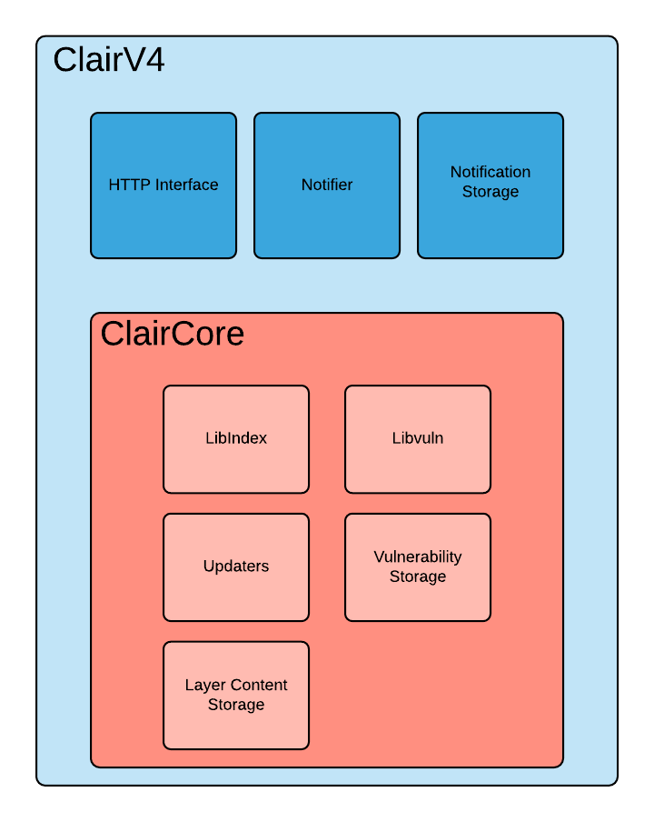

# What is Clair

Clair is an application for parsing image contents and reporting vulnerabilities affecting the contents. This is done via static analysis and not at runtime.

Clair supports the extraction of contents and assignment of vulnerabilities from the following official base containers:
- Ubuntu
- Debian
- RHEL
- Suse
- Oracle
- Alpine
- AWS Linux
- VMWare Photon
- Python

The above list defines Clair's current support matrix.

## Architecture

Clair v4 utilizes the [ClairCore](https://quay.github.io/claircore/) library as its engine for examining contents and reporting vulnerabilities. At a high level you can consider Clair a service wrapper to the functionality provided in the ClairCore library. 

The above diagram expresses the separation of concerns between Clair and the ClairCore library. Most development involving new distributions, vulnerability sources, and layer indexing will occur in ClairCore.

## How Clair Works

Clair's analysis is broken into three distinct parts.

### Indexing

Indexing starts with submitting a Manifest to Clair. On receipt, Clair will fetch layers, scan their contents, and return an intermediate representation called an IndexReport. 

Manifests are Clair's representation of a container image. Clair leverages the fact that OCI Manifests and Layers are content-addressed to reduce duplicated work.

Once a Manifest is indexed, the IndexReport is persisted for later retrieval. 

### Matching

Matching is taking an IndexReport and correlating vulnerabilities affecting the manifest the report represents. 

Clair is continually ingesting new security data and a request to the matcher will always provide you with the most up to date vulnerability analysis of an IndexReport.

*How we implement indexing and matching in detail is covered in [ClairCore's](https://quay.github.io/claircore/) documentation.*

### Notifications

Clair implements a notification service. 

When new vulnerabilities are discovered, the notifier service will determine if these vulnerabilities affect any indexed Manifests. The notifier will then take action according to its configuration.

### Getting Started

At this point you'll probably want to check out [Getting Started With Clair](./howto/getting_started.md).
