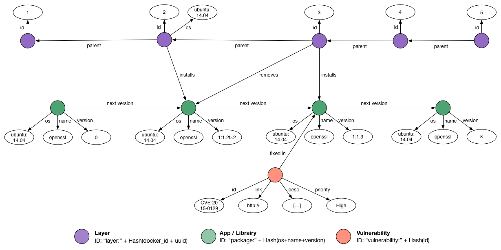

Clair
=====

[](https://travis-ci.org/coreos/clair)
[](https://quay.io/repository/coreos/clair)

Clair is a container vulnerability analysis service. It provides a list of vulnerabilities that threaten a container, and can notify users when new vulnerabilities that affect existing containers become known.

We named the project « Clair », which in French means *clear*, *bright*, *transparent*, because we believe that it enables users to have a clear insight into the security of their container infrastructure.

## Why should I use Clair?

Clair is a single-binary server that exposes a JSON HTTP API. It does not require any in-container monitoring agent, nor any other container modifications. It has been designed to perform massive analysis on the [Quay.io Container Registry](https://quay.io).

Whether you host a container registry, a continuous-integration system, or build anywhere from dozens to thousands of containers, you can benefit from Clair. More generally, if you consider that container security matters (and, honestly, you should), you should give it a try.

## How Clair Detects Vulnerabilities

Clair analyzes each container layer once, and does not execute the container to perform its examination. The scanning engine extracts all required data to detect known vulnerabilities, and caches layer data for examination against vulnerabilities discovered in the future.

Detecting vulnerabilities can be achieved with several techniques. One option is to compute hashes of binaries. These are presented on a layer and then compared with a database. However, building this database would become tricky considering the number of different packages and library versions.

To detect vulnerabilities, Clair instead takes advantage of common package managers, which quickly and comprehensively provide lists of installed binary and source packages. Package lists are extracted for each layer that composes your container image: the difference between the layer’s package list and its parent one is stored. This method is efficient in its use of storage, and allows Clair to scan each layer only once, though that layer may be used in many container images. Coupled with vulnerability databases such as the Debian’s Security Bug Tracker, Clair is able to tell which vulnerabilities threaten a container, and which layer and package introduced them.

### Graph

Internally, Clair implements a [graph structure to store and query layer data](docs/Model.md). The non-exhaustive example graph below corresponds to the following `Dockerfile`.

```
1.  MAINTAINER Quentin Machu <quentin.machu@coreos.com>
2.  FROM ubuntu:trusty
3.  RUN apt−get update && apt−get upgrade −y
4.  EXPOSE 22
5.  CMD ["/usr/sbin/sshd", "-D"]
```



The above image shows five layers represented by the purple nodes, associated with their IDs and parents. Because the second layer imports *Ubuntu Trusty* in the container, Clair can detect the operating system and some packages, depicted in green (we only show one here for the sake of simplicity). The third layer upgrades packages, so the graph reflects that this layer removes the previous version and installs the new one. Finally, the graph knows about a vulnerability, drawn in red, which is fixed by a particular package. Note that two synthetic package versions exist (0 and ∞): they ensure database consistency during parallel modification. ∞ also allows us to define very easily that a vulnerability is not yet fixed; thus, it affects every package version.

Querying this particular graph will tell us that our image is not vulnerable at all because none of the successor versions of its only package fix any vulnerability. However, an image based on the second layer could be vulnerable.

### Architecture

Clair is divided into X main modules (which represent Go packages):

- **api** defines how users interact with Clair and exposes a [documented HTTP API](docs/API.md).
- **worker** extracts useful informations from layers and store everything in the database.
- **updater** periodically updates Clair's vulnerability database from known vulnerability sources.
- **notifier** dispatches [notifications](docs/Notifications.md) about vulnerable containers when vulnerabilities are released or updated.
- **database** persists layers informations and vulnerabilities in [Cayley graph database](https://github.com/google/cayley).
- **health** summarizes health checks of every Clair's services.

Multiple backend databases are supported, a testing deployment would use an in-memory storage while a production deployment should use [Bolt](https://github.com/boltdb/bolt) (single-instance deployment) or PostgreSQL (distributed deployment, probably behind a load-balancer). To learn more about how to run Clair, take a look at the [doc](docs/Run.md).

#### Detectors & Fetchers

Clair currently supports three operating systems and their package managers, which we believe are the most common ones: *Debian* (dpkg), *Ubuntu* (dpkg), *CentOS* (rpm).

Supporting an operating system implies that we are able to extract the operating system's name and version from a layer and the list of package it has. This is done inside the *worker/detectors* package and extending that is straightforward.

All of this is useless if no vulnerability is known for any of these packages. The *updater/fetchers* package defines trusted sources of vulnerabilities, how to fetch them and parse them. For now, Clair uses three databases, one for each supported operating system:
- [Debian Security Bug Tracker](https://security-tracker.debian.org/tracker/)
- [Ubuntu CVE Tracker](https://launchpad.net/ubuntu-cve-tracker)
- [Red Hat Security Data](https://www.redhat.com/security/data/metrics/)

Using these distro-specific sources gives us confidence that Clair can take into consideration *all* the different package implementations and backports without ever reporting anything possibly inaccurate.

# Coming Soon

- Improved performances.
- Extended detection system
  - More package managers
  - Generic features such as detecting presence/absence of files
  - ...
- Expose more informations about vulnerability
  - Access vector
  - Acess complexity
  - ...

# Related links

- Talk @ ContainerDays NYC 2015 [[Slides]](https://docs.google.com/presentation/d/1toUKgqLyy1b-pZlDgxONLduiLmt2yaLR0GliBB7b3L0/pub?start=false&loop=false&slide=id.p) [[Video]](https://www.youtube.com/watch?v=PA3oBAgjnkU)
- [Quay](https://quay.io): First container registry using Clair.
